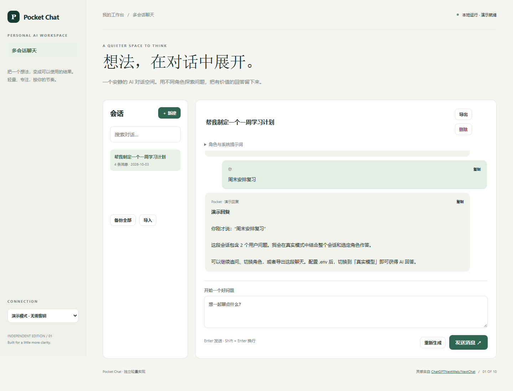

# Pocket Chat

一个安静的 AI 对话空间。用不同角色探索问题，把有价值的回答留下来。

- 独立会话与本地历史、可编辑会话名称
- 写作 / 编程 / 学习角色与自定义系统提示词
- 连续对话、重新生成、取消请求
- 会话搜索、Markdown 导出、JSON 备份与导入



## 快速开始

需要 Node.js 24 或更新版本；无第三方运行依赖，无需 npm install。

```sh
git clone https://github.com/Yiwen-Yang-BA/chatgpt-pocket-chat.git
cd chatgpt-pocket-chat
npm start
```

打开 http://127.0.0.1:3101 。默认进入**演示模式**，不调用 API，界面会明确标识规则生成的演示结果。

### 接入真实模型

复制 `.env.example` 为 `.env`，填写 `OPENAI_API_KEY`，按账号权限设置 `OPENAI_MODEL`，然后重启服务并切换界面中的「真实模型」。`OPENAI_BASE_URL` 必须支持 OpenAI Responses API；仅兼容 Chat Completions 的服务不适用。密钥只在服务端读取，不写入前端或仓库。

```sh
# Docker（可选；必须显式传入配置）
docker build -t chatgpt-pocket-chat .
docker run --rm -p 127.0.0.1:3101:3101 --env-file .env chatgpt-pocket-chat
```

## 使用方法

1. 新建会话，选择角色；也可以展开角色设置修改系统提示词。
2. 输入消息，按 Enter 发送；Shift+Enter 换行。演示回复明确标识为本地模板。
3. 使用重新生成或停止；会话历史会保存在当前浏览器。
4. 导出当前会话为 Markdown，或备份全部会话为 JSON。

## 验证

```sh
npm run check
npm test
```

测试覆盖业务规则以及本地 HTTP 服务、模拟模型接口、输入校验和错误处理。真实付费模型调用需要用户配置有效密钥，未将演示测试作为真实模型质量验证。GitHub Actions 在每次推送时运行检查。

## 参考与复刻范围

灵感来自 [ChatGPTNextWeb/NextChat](https://github.com/ChatGPTNextWeb/NextChat)（MIT）。查询快照：2026-10-04；88,824 stars；最近推送 2026-08-11。这是当前星标量与更新状态，**不是近一个月新增星标排名**。

本仓库是对其核心交互和用途的独立轻量实现，未复制上游源码、商标或静态资源，不声称实现上游的全部功能，也不属于上游官方产品。

实现 NextChat 的轻量多会话与角色交互。暂不包含图片、语音、账号同步、插件、付费套餐和流式响应；整条模型结果完成后显示。

## 数据与部署边界

工作内容保留在当前浏览器本地存储中；可导出备份。 演示模式数据不离开本机；真实模式会将本次输入发送至所配置的模型服务。

默认只监听 127.0.0.1，适用于单人本地使用；没有多用户登录或持久数据库。如需公网部署，请先增加身份验证、配额和 HTTPS。服务限制请求大小、并发和超时，禁止从静态目录读取密钥文件。

接口实现依据 [OpenAI 官方文本生成文档](https://developers.openai.com/api/docs/guides/text)。

## License

MIT — independent implementation.
